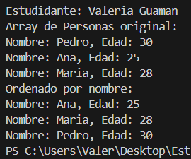

# Estructura de Datos

**Estudiante:** Kelly Valeria Guaman Leon

## Metodos Ordenamiento

### Practica 1 - 20/OCT
Metodo Sort Bubble

### Practica 2 - 21/OCT
Metodo Sort Selection en Java y Python

Salida de python

Salida de Java

Arrelgo de numeros enteros

Arreglo de cadenas (nombres)

Arreglo de personas Ordenadas por nombre

Arreglo de personas Ordenadas por edad
